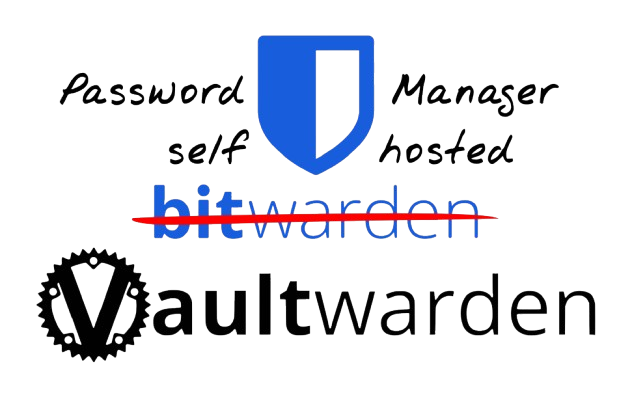
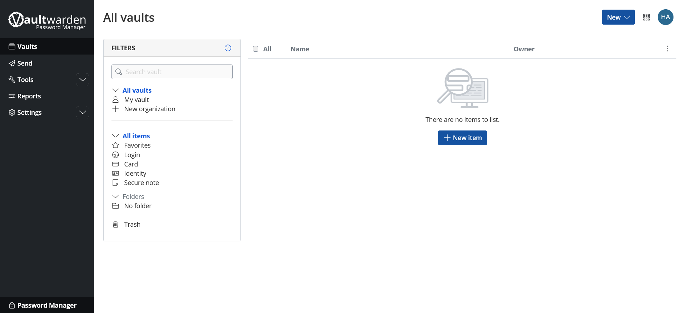
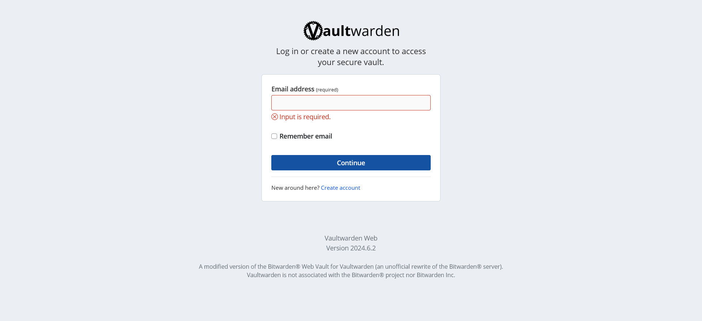
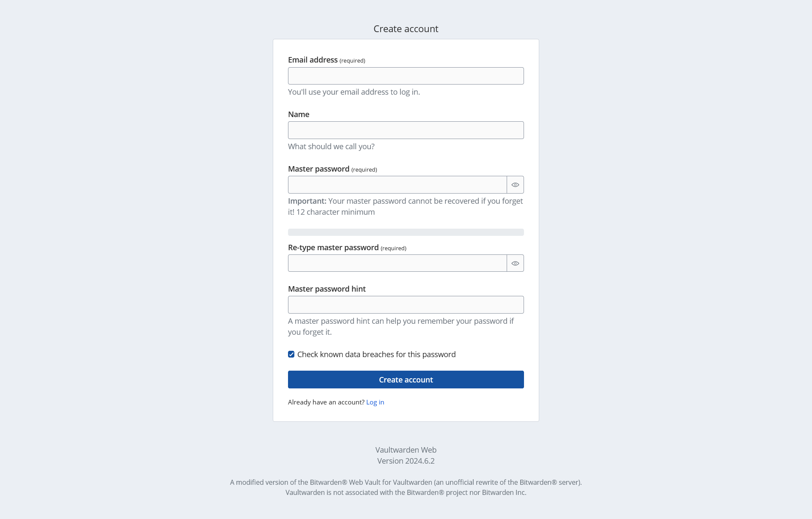
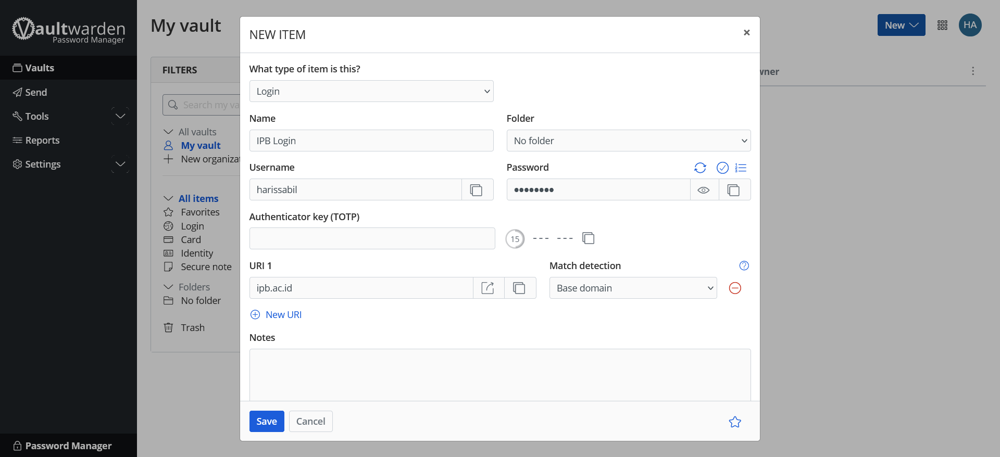
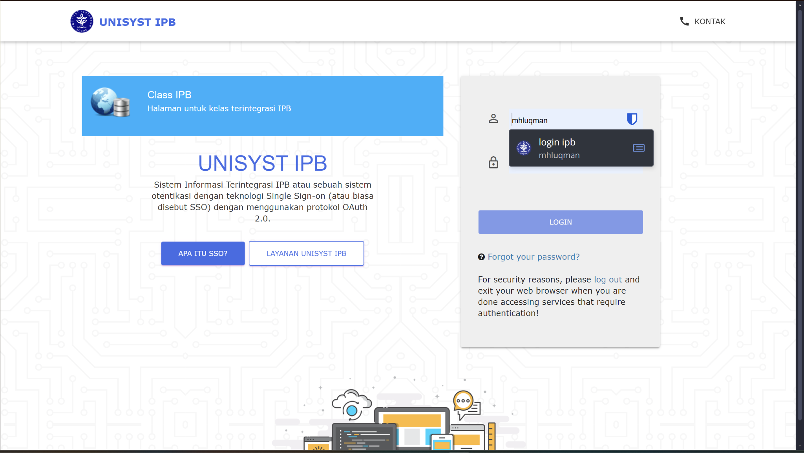

<p align="center">
  <a href="https://github.com/darrelazmi/PassManager/">
    
  </a>
</p>

<p align="center">
  
  
  
<!--    -->
  </p>

<p align="center">
  Aplikasi web sederhana untuk mengatur password  Anda.
  <br>
  Didesain untuk dihosting sendiri.
  <br>
  <em>Reference by [PasswordManager](https://github.com/dani-garcia/vaultwarden).</em>
</p>

[Sekilas Tentang](#sekilas-tentang) | [Instalasi](#instalasi) | [Otomatisasi](#otomatisasi) | [Cara Pemakaian](#cara-pemakaian) | [Pembahasan](#pembahasan) | [Referensi](#referensi)
:---:|:---:|:---:|:---:|:---:|:---:

    
# Sekilas Tentang


[!PasswordManager](https://github.com/dani-garcia/vaultwarden)<br>
Vaultwarden merupakan sebuah web app yang bertujuan untuk membantu anda dalam menyimpan password didalam cloud. Pada web app ini, kita dapat menyimpan password dengan menandai tipe password, nama dari passwordnya, username dan tentunya juga password yang ingin kita simpan di cloud. Kelebihan yang didapatkan dari web app ini adalah password yang disimpan di Vaultwarden memiliki keamanan extra dari server yang membuat password yang disimpan di web ini jauh lebih aman.

## Instalasi
[`^ kembali ke atas ^`](#)

### Kebutuhan Sistem :
- Sistem Operasi: Linux Ubuntu
- Docker: Docker versi terbaru
- RAM: 64Mb atau lebih tinggi

### Proses Instalasi :
#### Docker
Proses instalasi menggunakan Docker hanyalah salah satu cara, banyak cara lainnya yang bisa disesuaikan dengan preferensi masing-masing.

1. *Hapus* package yang konflik:
```
for pkg in docker.io docker-doc docker-compose docker-compose-v2 podman-docker containerd runc; do sudo apt-get remove $pkg; done
```

2. *Add Docker's* official GPG key:
```
sudo apt-get update
sudo apt-get install ca-certificates curl
sudo install -m 0755 -d /etc/apt/keyrings
sudo curl -fsSL https://download.docker.com/linux/ubuntu/gpg -o /etc/apt/keyrings/docker.asc
sudo chmod a+r /etc/apt/keyrings/docker.asc
```

3. *Add the Repository* to Apt sources:
```
echo \
  "deb [arch=$(dpkg --print-architecture) signed-by=/etc/apt/keyrings/docker.asc] https://download.docker.com/linux/ubuntu \
  $(. /etc/os-release && echo "$VERSION_CODENAME") stable" | \
  sudo tee /etc/apt/sources.list.d/docker.list > /dev/null
sudo apt-get update
```


4. *Install* the latest version of docker package:
```
sudo apt-get install docker-ce docker-ce-cli containerd.io docker-buildx-plugin docker-compose-plugin
```

#### INSTALL CONTAINER VAULTWARDEN

- Install Vaultwarden dari public docker repo.
```
docker run --name vaultwarden --hostname vaultwarden \
  --network proxy-net --volume ./vaultwarden:/data --detach \
  vaultwarden/server
```

#### INSTALL CONTAINER CADDY

- Install Caddy:
```
docker run --name caddy --network proxy-net \
  --publish 80:80 --publish 443:443 --detach \
  caddy caddy reverse-proxy --from vault.raikun.me --to vaultwarden:80
```
  
## Otomatisasi
[`^ kembali ke atas ^`](#page1)

Cara lain untuk mempersingkat proses instalasi adalah menggunakan *shell script*. *Shell script* adalah kumpulan kode yang dapat dijalankan di Unix shell. Berikut adalah kumpulan *shell script* untuk instalasi, menjalankan, serta menghentikan server aplikasi.

#### Cara menjalankannya dengan perintah `./(nama).sh`
- [setup.sh](https://github.com/HijazP/i-hate-to-budget/shell/setup.sh) berisi kode `git clone` dan `cp`.

*Shell script* `user.sh`, `start.sh`, dan `stop.sh` dan dijalankan kapanpun setelah `setup.sh` dan `change.sh` dijalankan.


## Cara Pemakaian
[`^ kembali ke atas ^`](#)
- Tampilan Aplikasi Web
    - Tampilan Halaman Log In
        
    - Tampilan Halaman Daftar
        
    - Tampilan Utama Aplikasi
        
- Fungsi-fungsi utama
    - Menambah Password Baru
        
- Contoh Penggunaan
    - Contoh Penggunaan Vaultwarden Untuk Mengisi Password
        

## Pembahasan
[`^ kembali ke atas ^`](#)

- Pendapat anda tentang aplikasi web ini
    - ### Kelebihan
      1. Dapat mengatur sendiri kategori pengeluaran
      
      2. Dapat melihat history pengeluaran
      
      3. Terdapat insight pengeluaran per bulannya
      

    - ### Kekurangan
      1. Hanya mencatat jumlah pengeluaran, tidak mencatat saldo yang ada
      
      2. Tidak bisa lebih dari 1 akun dalam 1 server
      
      
- Bandingkan dengan aplikasi web lain yang sejenis
  ### Money Lover
  1. Terdapat pembagian untuk sumber uang
  
  2. Kategori pengeluaran sudah tersedia, namun tidak dapat dikustomisasi
  
  
  ### SikapiUangmu - OJK
  1. Terdapat opsi untuk menghitung harta dan dikurangi dengan utang yang dimiliki
  
  2. Terdapat kalkulator untuk menghitung kesehatan keuangan
  

## Referensi
- [Azure Cloud](https://azure.microsoft.com/id-id/)
- [Docker](https://www.docker.com/)
- [Money Lover](https://moneylover.me/)
- [SikapiUangmu - OJK](https://sikapiuangmu.ojk.go.id/FrontEnd/Kalkulator/Kalkulator%20Dompet)

[`^ kembali ke atas ^`](#)
